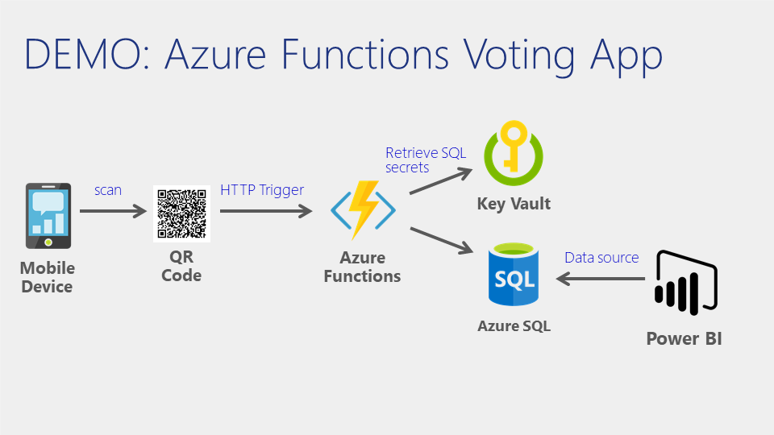
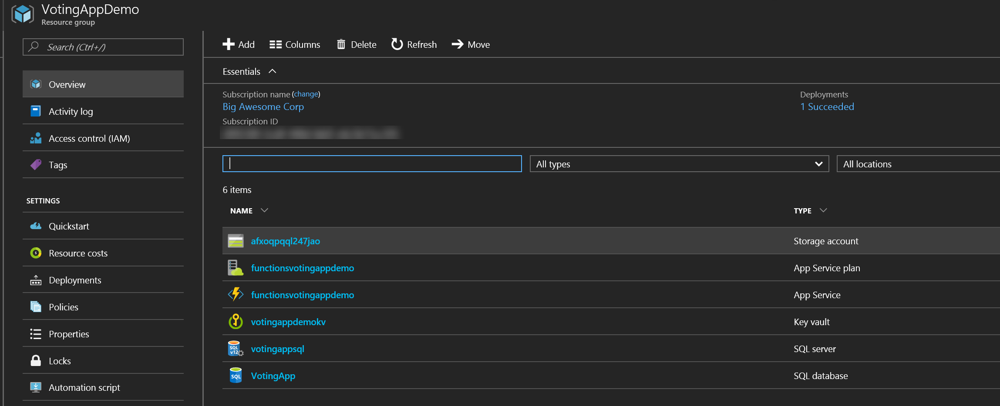
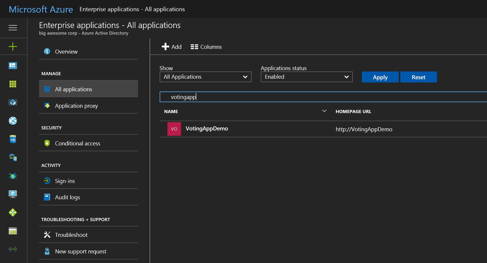
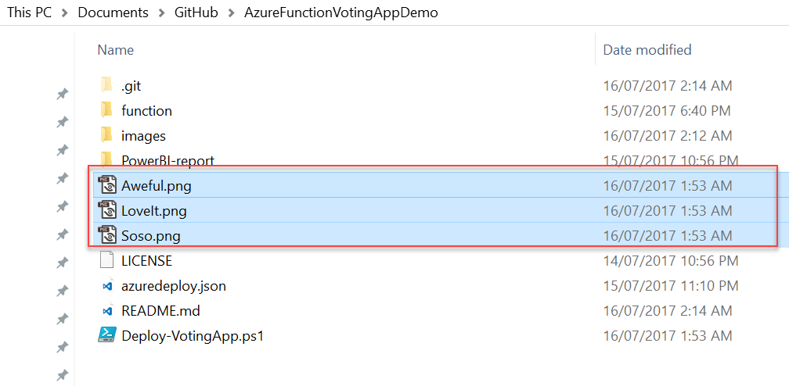
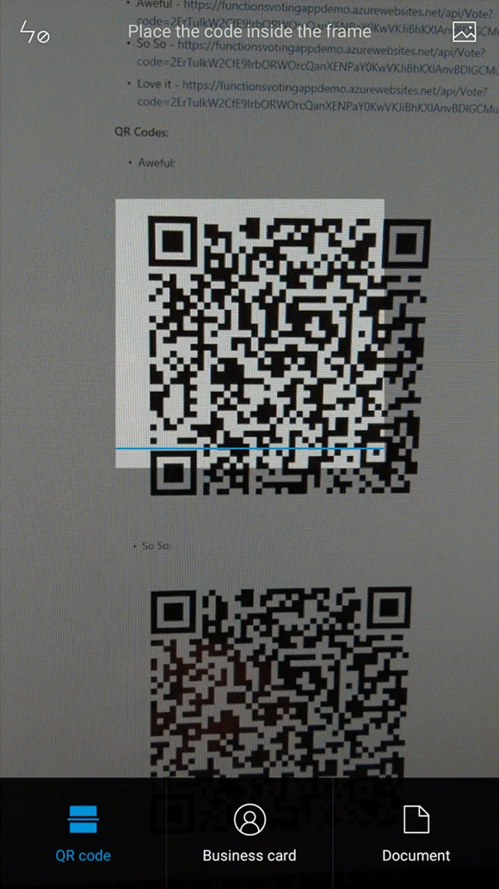
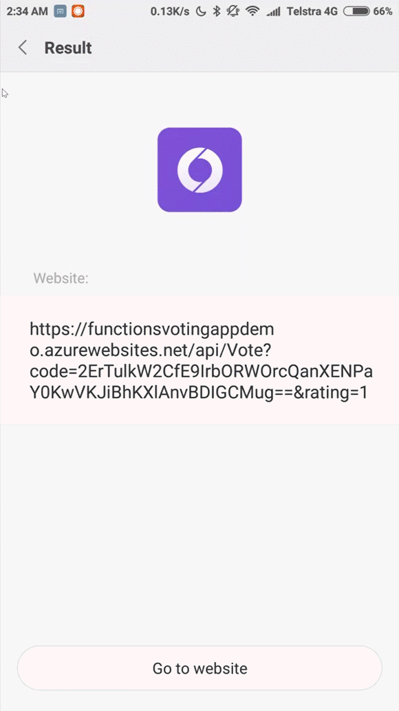
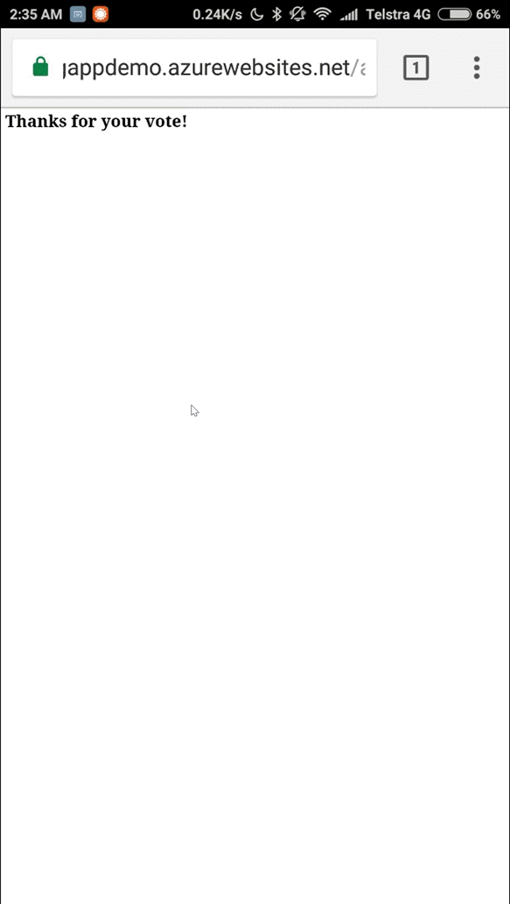
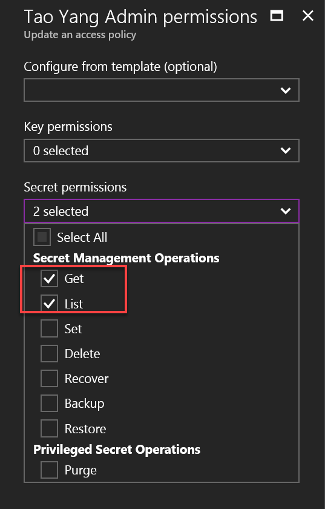
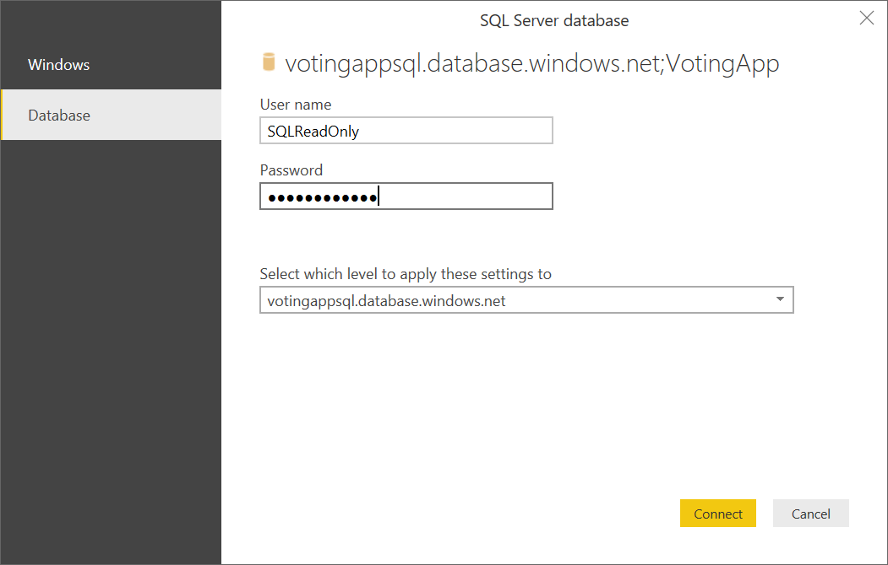
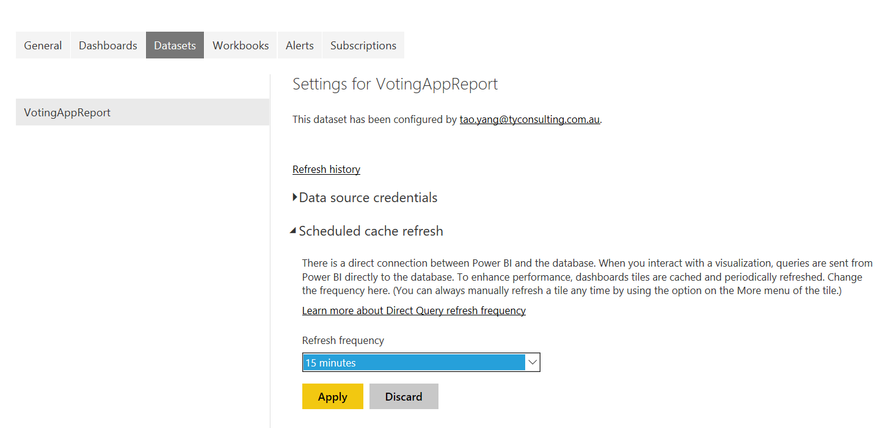

# Azure Function Demo - Voting App
Author - Tao Yang (TY Consulting Pty. Ltd.)

**Copyright - (c) 2017 TY Consulting Pty. Ltd. All rights reserved.**

## Description
This folder contains the deployment artifacts for an Azure Functions demo app. This demo app allows users to cast vote using a HTTP GET request (i.e. by hitting an URL from browser, or scanning a QR code from mobile devices). In this demo, users can vote how much they love the famous Australian food Vegemite ([https://www.youtube.com/watch?v=P_sUhTWtvG4](https://www.youtube.com/watch?v=P_sUhTWtvG4))

> **Note:** This demo was originally developed for Pete Zerger and Tao Yang's Experts Live Australia 2017 presentation Cloud Automation Overview. In the presentation, the attendees voted by scanning the QR codes from a slide like this:


## Architecture
This demo app is made up using the following Microsoft cloud based services:
* Azure Resources:
    * Azure Functions App
    * Azure SQL Database
    * Azure Key Vault
    * Azure AD Application and Service Principal
* Office 365 Application:
    * Power BI Pro account
    


When the Azure Function is triggered via HTTP request, it performs the following steps:
1. Retrieves the Azure SQL server FQDN, database name and credential from Azure Key Vault
2. Insert the vote, client IP and time stamp to the Azure SQL database
3. Return either a successful or failure message in HTTP response

The vote result can be accessed by either querying the Azure SQL database, or via a Power BI report that is connected to the Azure SQL database.


## Provisioning Process
### Provisioning Process Overview
Most of the components are deployed using the PowerShell script **Deploy-VotingApp.ps1**. This PowerShell script performs the following actions:
1. Checking if the following Azure resource names are avaiable (to be used):
    * Azure Function Apps Name
    * Azure SQL Server Name
    * Azure Key Vault Name
2. Create an Azure AD Application, Service Principal and certificate based key credential
3. Deploying an Azure Resource Manager (ARM) template. This template deploys the following resources:
    * Azure Function App (website, storage account, function app service)
        * Application settings
        * Retrieving Azure AD application certificate from Key Vault and stored in the web site
    * Azure Key Vault
        * Key Vault secret (SQL server FQDN, database name, credentials and Azure AD Application certificate)
    * Azure SQL Server and database
4. Once the ARM template is deployed, performing steps that cannot be performed within ARM templates:
    * Retrieving Azure Function app Kudu API credential
    * Deploying Azure Function source code using Kudu API
    * Creating SQL database read-only user
    * Executing SQL queries to configure the Azure SQL database
5. Creating QR Codes for each vote options

After executing the Deploy-VotingApp.ps1 script, you will need to manually create Power BI report (based on the report provided in this repository).

### Pre-requisites
#### PowerShell modules
The following PowerShell modules are required to execute the Deploy-VotingApp.ps1 PowerShell script:
* AzureRM.Profile
* AzureRM.Resources
* AzureAD
* QrCodes

All of these modules can be found from the PowerShell gallery ([https://www.PowerShellGallery.com](https://www.PowerShellGallery.com)), can be installed using command **Install-Module [Module-name] -Force** on computers running Windows Powershell version 5 or later.

### Azure AD and Subscription Privilege
You will need to specify a credential for a user that has admin privilege for Azure AD tenant and Azure subscription.

### Executing Deploy-VotingApp.ps1 Script
Syntax:
``` PowerShell
.\Deploy-VotingApp.ps1 $(Get-Credential)
```
When prompted, specify your Org Id that has admin access to both Azure AD tenant and Azure subscription.

The script takes approximately 10 minutes to execute. Once completed, you are able to see the following components in the resource group that you have specified (the names will be slightly different.)
**Azure Resources:**


**Azure AD Application:**


The QR code images are saved to the $PSScriptRoot folder (same folder of the deploy-votingapp.ps1 script):


## Casting Votes
To cast votes, end users can either browse to various URLs in the browser or scan QR codes using mobile devices.
For the demo environment, the URLs and QR codes are listed below:

**URLs:**

* Aweful - [https://functionsvotingappdemo.azurewebsites.net/api/Vote?code=2ErTulkW2CfE9IrbORWOrcQanXENPaY0KwVKJiBhKXlAnvBDIGCMug==&rating=1](https://functionsvotingappdemo.azurewebsites.net/api/Vote?code=2ErTulkW2CfE9IrbORWOrcQanXENPaY0KwVKJiBhKXlAnvBDIGCMug==&rating=1)
* So So - [https://functionsvotingappdemo.azurewebsites.net/api/Vote?code=2ErTulkW2CfE9IrbORWOrcQanXENPaY0KwVKJiBhKXlAnvBDIGCMug==&rating=2](https://functionsvotingappdemo.azurewebsites.net/api/Vote?code=2ErTulkW2CfE9IrbORWOrcQanXENPaY0KwVKJiBhKXlAnvBDIGCMug==&rating=2)
* Love it - [https://functionsvotingappdemo.azurewebsites.net/api/Vote?code=2ErTulkW2CfE9IrbORWOrcQanXENPaY0KwVKJiBhKXlAnvBDIGCMug==&rating=3](https://functionsvotingappdemo.azurewebsites.net/api/Vote?code=2ErTulkW2CfE9IrbORWOrcQanXENPaY0KwVKJiBhKXlAnvBDIGCMug==&rating=3)

**QR Codes:**
* **Aweful:**


* **So So:**


* **Love It:**


### Vote Using Mobile Devices
1. Scan QR code:



2. Browse to the URL:



3. HTTP Response displayed in the browser:



## Power BI Report
You may use the [Power BI report](PowerBI-report\VotingAppReport.pbix) provided in this repository and import it to your Power BI account.

### Importing Power BI report
To import the Power BI report, firstly you will need to retrieve the SQL Read-Only account credential from key vault. To access the secrets, you may need to give yourself access in the key vault:



Once the read-only user credential is retrieved, you need to open the Power BI report in Power BI desktop and modify the connection



Once the report is loaded, you can publish it to Power BI Online.


### Sample Report
> **Note:** This report uses direct query, however, cache refresh is scheduled to run every 15 minutes. you may need to refresh the page after voting in order to see the change reflected on this report.

[**Open Report**](https://app.powerbi.com/view?r=eyJrIjoiZDJhNzZhMGYtNjhiOS00ZDYwLTg0OWMtNWJlNTJhMThhZGJmIiwidCI6Ijc4Mzk2MjQwLTY0OWEtNGJmNC05NDE1LWQ3NDAwMWIyNGQwNyIsImMiOjEwfQ%3D%3D)
